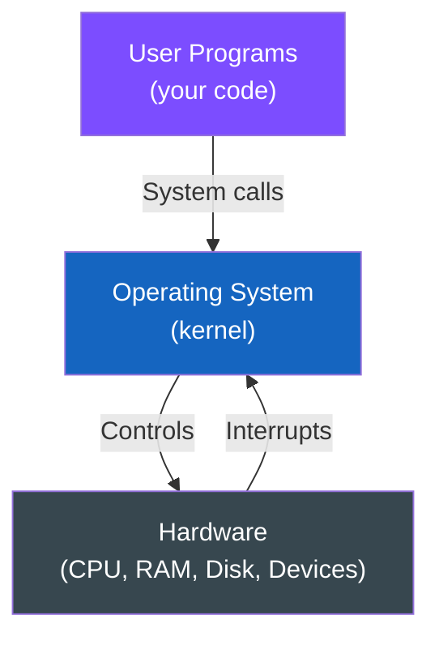
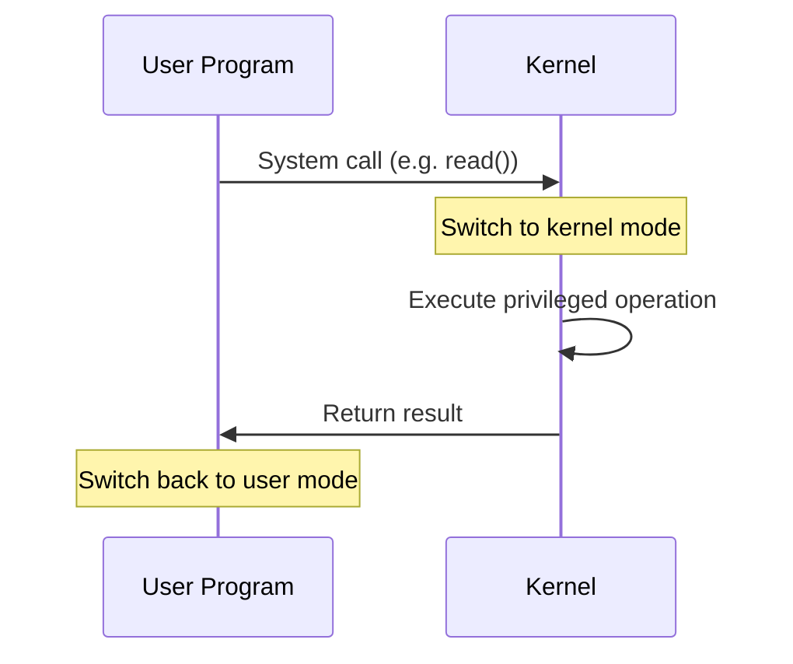
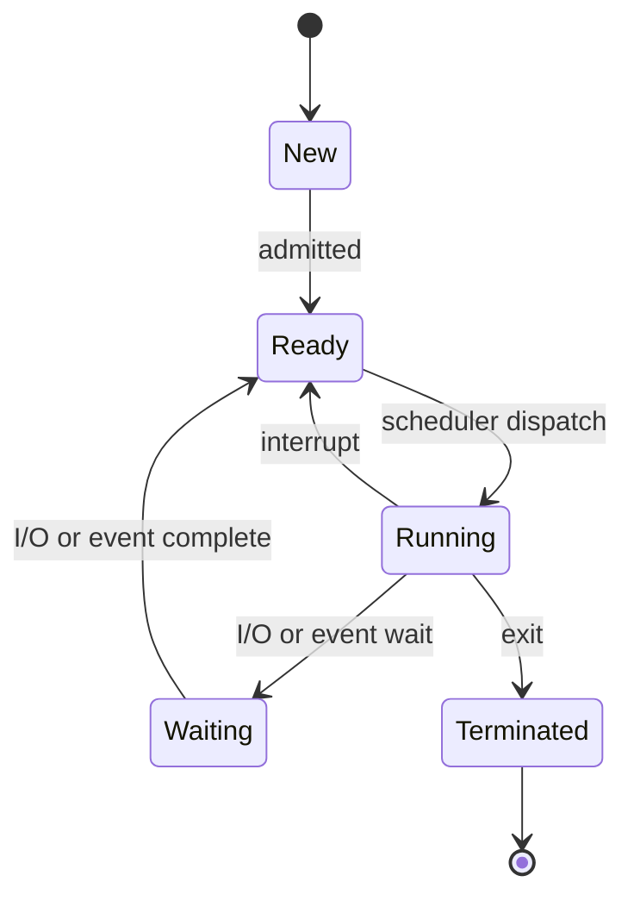

# Introduction to Operating Systems

## What is an Operating System?

An operating system (OS) is the software layer that sits between your programs and the hardware.



---

## Two Core Jobs

1. **Intermediary/Environment Provider**: It provides an environment where you can execute programs conveniently and efficiently

2. **Resource Manager**: It allocates and manages scarce resources (CPU time, memory, devices, files) so multiple programs/users can safely share the machine

---

## Two-Lens View

### Extended Machine
OS gives you nicer abstractions than raw hardware:
- Processes (instead of raw CPU)
- Address spaces (instead of physical memory)
- Files (instead of disk blocks)

### Resource Manager
OS coordinates and protects the hardware so the system runs efficiently and correctly.

---

## System Calls

How does software cross the boundary into the OS?

Through **System calls** (`open`, `read`, `write`, `fork`) which are the "official API" into Kernel services.

To keep things safe, CPUs support at least **user mode** and **kernel mode**, switching into kernel mode on a system call/trap/interrupt.



---

## Kitchen Analogy

The CPU is the stove, RAM is counter space, disks are pantry storage, and devices are appliances.

The OS is the head chef and kitchen manager:
- You (a program in user mode) don't walk into the kitchen and touch the stove wiring directly
- You place an "order" via a system call
- The manager decides when you get stove time, how much counter space you get, and stops you from wrecking someone else's meal

This is protection via user/kernel mode.

---

## Processes

A process is a program in execution plus everything the OS needs to run it: CPU state, memory mapping, open files, etc.

The OS tracks each process using a **Process Control Block (PCB)** which stores at minimum:
- Process State
- Program counter
- CPU registers
- Scheduling info
- Memory-management info
- I/O Status like open files

---

## Process States



Only one process can be running per CPU core at a time. Others are ready or waiting.

---

## Context Switch

A context switch happens when the OS stops one running process and resumes another by saving/restoring its CPU state (registers + PC) in/from the PCB.

Interrupts (especially timer interrupts) are a classic trigger that forces the OS to regain control and potentially switch the running process.

---

## Observing Process State

```bash
# 1. Start a CPU hog
yes > /dev/null &

# 2. Get its PID
echo $!

# 3. Inspect it with ps
ps -p <PID> -O pid,ppid,stat,comm

# 4. Watch it live
top -p <PID>

# 5. Stop/continue/kill it
kill -STOP <PID>
kill -CONT <PID>
kill <PID>
```

---

## Stopped vs Sleeping/Waiting

**Stopped (SIGSTOP)**
- The process is paused on purpose by a signal
- It could run but the OS says "you're not allowed to run right now"
- Will stay paused until it gets SIGCONT or you kill it

**Sleeping/Waiting**
- The process literally cannot make progress yet
- Waiting for something external: keyboard input, disk read, network packet, or a lock

### Important for Scheduling

- **Stopped**: scheduler ignores it because it's forbidden to run
- **Waiting**: scheduler ignores it because it's unable to run