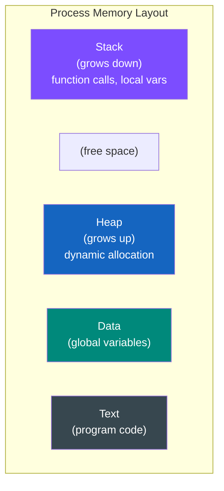
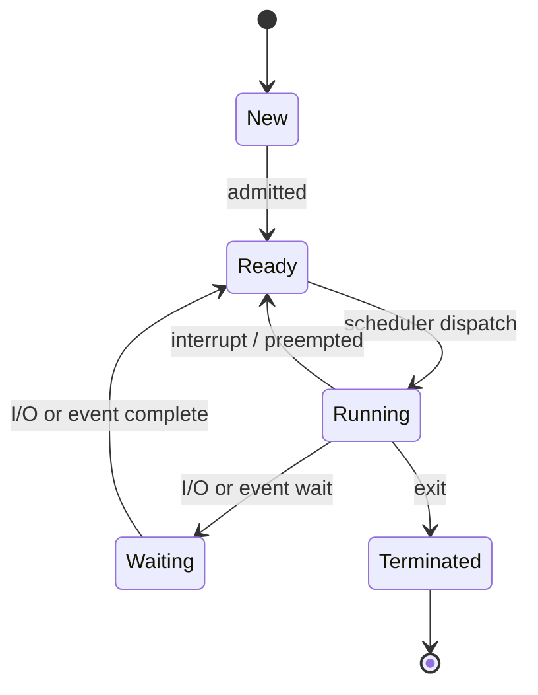
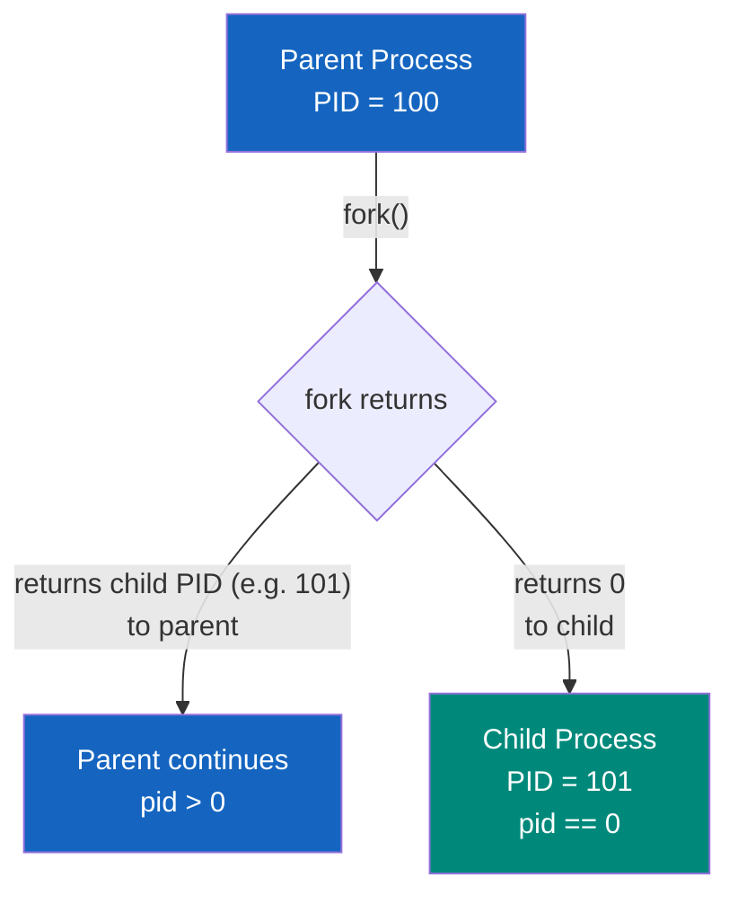
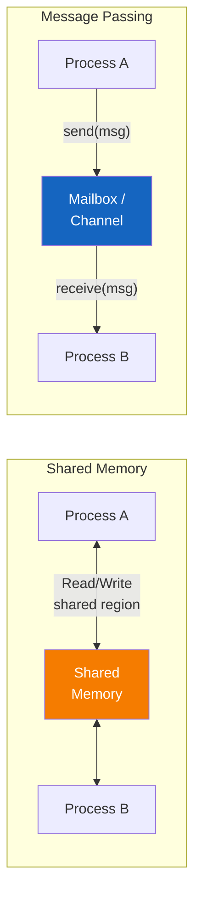
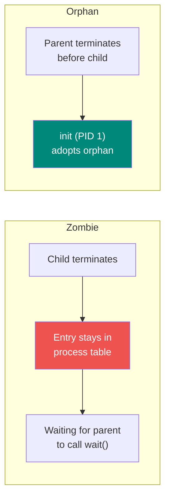

# Processes and Process Management

## Process Concept

A process is a program in execution. It includes:

- Program code (text section)
- Current activity (program counter, register contents)
- Stack (temporary data like function parameters, return addresses)
- Data section (global variables)
- Heap (dynamically allocated memory)



---

## Process Control Block (PCB)

The OS maintains a PCB for each process containing:

- Process state (running, waiting, etc.)
- Program counter
- CPU registers
- CPU scheduling information (priority, scheduling queue pointers)
- Memory management information (page tables, segment tables)
- Accounting information (CPU time used, time limits)
- I/O status information (list of open files, I/O devices allocated)

---

## Process States



1. **New**: Process is being created
2. **Ready**: Waiting to be assigned to a processor
3. **Running**: Instructions are being executed
4. **Waiting**: Waiting for some event (I/O completion, signal)
5. **Terminated**: Process has finished execution

---

## Process Creation

### fork() System Call

Creates a new process by duplicating the calling process.



```c
pid_t pid = fork();

if (pid == 0) {
    // Child process code
    printf("I am the child\n");
} else if (pid > 0) {
    // Parent process code
    printf("I am the parent, child PID is %d\n", pid);
} else {
    // fork() failed
    perror("fork");
}
```

**After fork():**
- Child gets a copy of parent's memory space
- Child has its own PID
- Both processes continue from the point after fork()
- Return value distinguishes parent (positive PID) from child (0)

### exec() Family

Replaces the current process image with a new program.

```c
execlp("ls", "ls", "-l", NULL);
// If successful, this line never executes
perror("execlp");
```

**Common exec() variants:**
- `execl()`: Takes arguments as list
- `execlp()`: Searches PATH for the program
- `execv()`: Takes arguments as array
- `execvp()`: Array + PATH search

### wait() System Call

Parent process waits for child to terminate.

```c
int status;
pid_t child_pid = wait(&status);
printf("Child %d terminated\n", child_pid);
```

---

## Inter-Process Communication (IPC)



### 1. Shared Memory
Processes share a region of memory. Faster but requires synchronization.

### 2. Message Passing
Processes communicate by sending messages. Slower but easier to implement.

---

## Pipes

### Ordinary Pipes

Unidirectional communication between parent and child processes.

```c
int fd[2];
pipe(fd);    // fd[0] is read end, fd[1] is write end

if (fork() == 0) {
    close(fd[0]);
    write(fd[1], "Hello", 5);
    close(fd[1]);
} else {
    close(fd[1]);
    char buf[10];
    read(fd[0], buf, 5);
    close(fd[0]);
}
```

### Named Pipes (FIFOs)

Bidirectional, can be used by unrelated processes, exists as a file in the filesystem.

```bash
mkfifo mypipe
echo "Hello" > mypipe &    # Writer
cat < mypipe               # Reader
```

---

## Zombie and Orphan Processes



**Zombie**: A terminated process whose parent hasn't yet called `wait()`. Takes up space in the process table.

**Orphan**: A process whose parent has terminated. The init process (PID 1) adopts orphans.