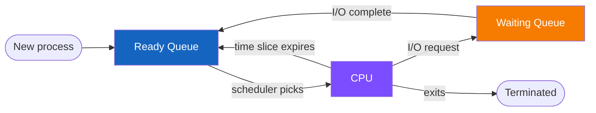
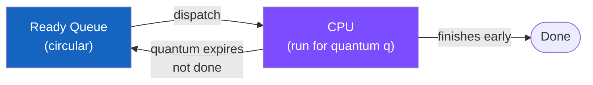

# CPU Scheduling

## Overview

When multiple processes are ready, the OS must choose who gets the CPU next.



### Types

**Non-preemptive**: Once a process starts running, it keeps the CPU until it blocks or finishes

**Preemptive**: The OS can interrupt it (timer interrupt) and run someone else

### Quality Metrics

- **Waiting time**: Time spent in ready queue
- **Turnaround time**: Total time from arrival to completion
- **Response time**: Time from arrival to first run

---

## Scheduling Algorithms

### FCFS (First-Come, First-Served)

**Rule**: Run processes in the order they arrive

**Type**: Non-preemptive



```mermaid
gantt
    title FCFS — P1(burst=6), P2(burst=3), P3(burst=2) arrive at t=0
    dateFormat X
    axisFormat %s

    section CPU
    P1 :0, 6
    P2 :6, 9
    P3 :9, 11
```

!!! warning "Convoy Effect"
    One long job makes all short jobs wait behind it.

---

### SJF (Shortest Job First)

**Rule**: Always run the process with the smallest CPU burst time

**Type**: Non-preemptive

**Upside**: Optimal average waiting time (in theory)

**Downside**: Needs burst-time estimates, can cause starvation for long jobs

---

### SRTF (Shortest Remaining Time First)

**Description**: Preemptive version of SJF

**Rule**: Always run the process with the smallest remaining CPU burst time

**Preemption**: If a new process arrives with a shorter remaining time than the current running one, the OS preempts to it

---

### Round Robin (RR)

```mermaid
gantt
    title Round Robin — P1(6), P2(3), P3(2), quantum=2
    dateFormat X
    axisFormat %s

    section CPU
    P1 :0, 2
    P2 :2, 4
    P3 :4, 6
    P1 :6, 8
    P2 :8, 9
    P1 :9, 11
```





**Tradeoff**:
- Quantum too small: too many context switches, high overhead
- Quantum too large: behaves like FCFS, bad response time

---

### Priority Scheduling

**Rule**: Each process is assigned a priority. CPU goes to highest-priority ready process.

**Types**:
- **Preemptive**: If higher-priority process arrives, preempt current one
- **Non-preemptive**: Let current process finish its burst

!!! danger "Starvation"
    Low-priority processes may never run.

!!! tip "Solution: Aging"
    Gradually increase the priority of waiting processes over time.

---

## Formulas

```
Turnaround Time  = Completion Time - Arrival Time
Waiting Time     = Turnaround Time - Burst Time
Response Time    = First Run Time - Arrival Time

Average Waiting Time = Sum(Waiting Times) / Number of Processes
```

---

## Scheduling Comparison

| Algorithm | Preemptive | Optimal | Starvation Risk | Overhead |
|-----------|-----------|---------|-----------------|----------|
| FCFS | No | No | No | Low |
| SJF | No | Yes (avg wait) | Yes | Low |
| SRTF | Yes | Yes (avg wait) | Yes | Medium |
| RR | Yes | No | No | High |
| Priority | Both | Depends | Yes | Medium |

---

## Useful Commands

```bash
# Process status snapshot
ps -p <PID> -o pid,ppid,stat,comm

# Live updating view
top -p <PID>
```

**ps stat codes**: R=running, S=sleeping, T=stopped