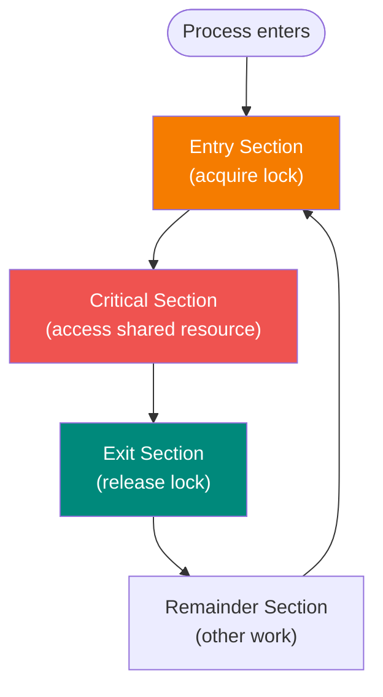
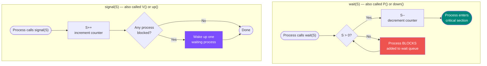
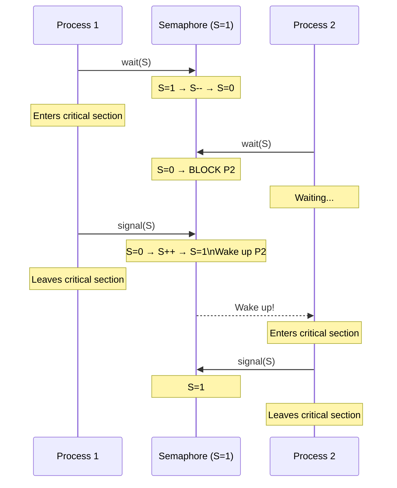
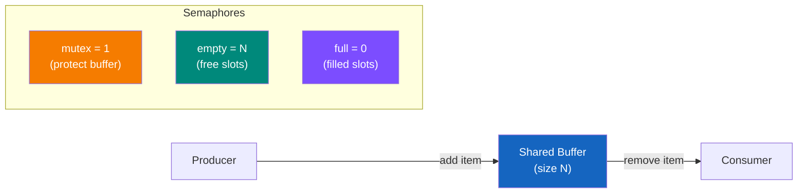
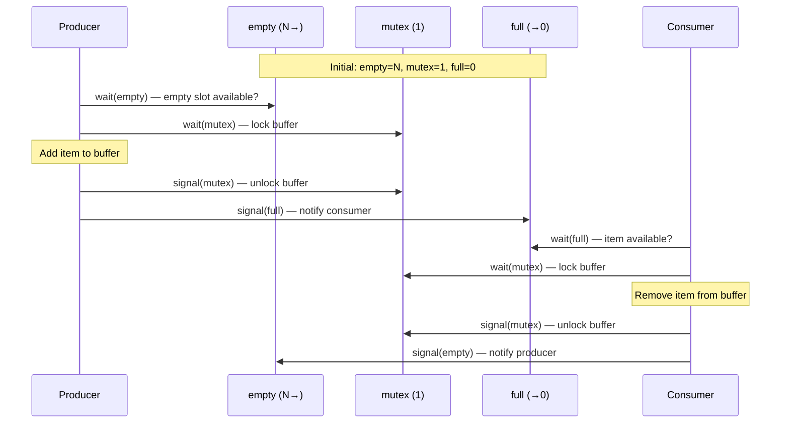
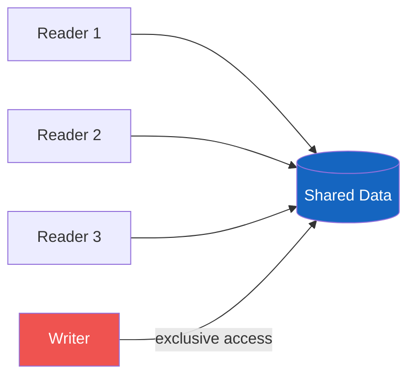
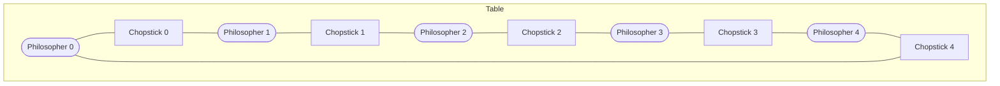
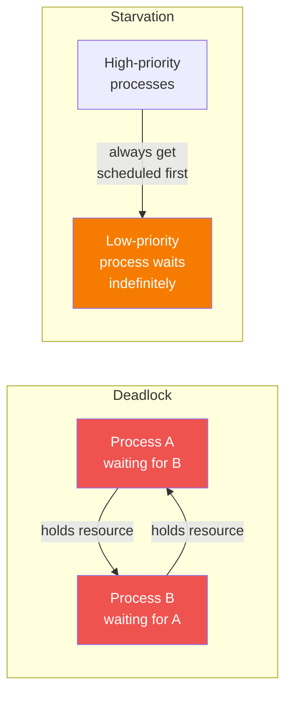

# Process Synchronization

## Critical Section Problem

The critical section is a segment of code where a process accesses shared resources.



### Requirements for a Solution

1. **Mutual Exclusion**: Only one process in the critical section at a time
2. **Progress**: Decision on who enters CS cannot be postponed indefinitely
3. **Bounded Waiting**: Limit on times others can enter CS before a waiting process gets in

---

## Race Conditions

A race condition occurs when two or more processes access shared data concurrently, and the final result depends on timing.

---

## Semaphores

A semaphore `S` is an **integer counter** accessed through two atomic operations.

### How a Semaphore Works



### Semaphore as a Traffic Light



### Types of Semaphores

**Binary semaphore (mutex):** Values 0 or 1 — used for mutual exclusion

**Counting semaphore:** Any non-negative value — used to manage a pool of resources

---

## Mutex (Mutual Exclusion)

A mutex is a binary semaphore used specifically for mutual exclusion.

```c
acquire(mutex);
// --- critical section ---
release(mutex);
```

---

## Classic Synchronization Problems

### Producer-Consumer Problem





---

### Readers-Writers Problem

**Rules:**
- Multiple readers can read simultaneously
- Only one writer can write at a time
- No readers when a writer is writing



**First readers-writers solution**: Readers have priority (writers may starve)

**Second readers-writers solution**: Writers have priority (readers may starve)

---

### Dining Philosophers Problem



**Problem:** Deadlock if all philosophers pick up their left chopstick simultaneously.

**Solutions:**
1. Allow at most 4 philosophers to sit at the table
2. Pick up chopsticks only if both are available (atomic)
3. Asymmetric: odd philosophers pick up left first, even pick up right first

---

## Deadlock vs Starvation



**Deadlock**: A set of processes are waiting for each other in a cycle — none can proceed

**Starvation**: A process waits indefinitely because other processes keep getting priority

---

## Monitor

A monitor is a high-level synchronization construct that encapsulates:

- Shared data
- Procedures that operate on the data
- Synchronization primitives (automatic mutual exclusion)

Only one process can be active in the monitor at a time.