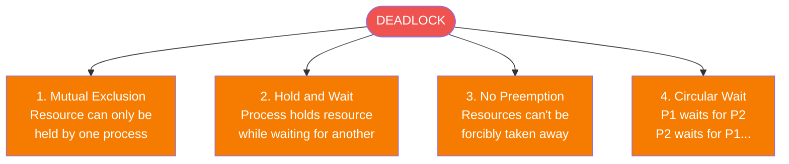
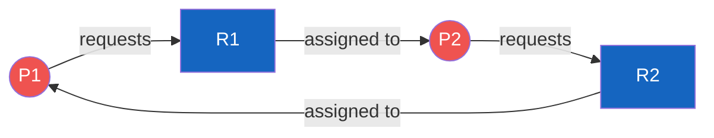
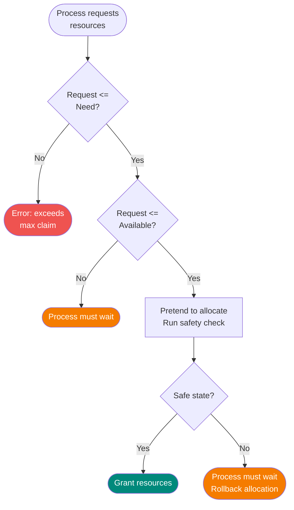
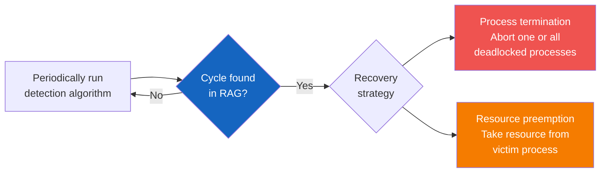

# Deadlock

## Definition

A deadlock is a situation where a set of processes are blocked because each process is holding a resource and waiting for another resource held by another process in the set.

---

## Four Necessary Conditions (Coffman Conditions)

ALL four must hold simultaneously for deadlock to occur:



1. **Mutual Exclusion**: At least one resource must be non-shareable
2. **Hold and Wait**: A process holds at least one resource and is waiting for more
3. **No Preemption**: Resources cannot be forcibly taken from processes
4. **Circular Wait**: A circular chain of processes, each waiting for the next

---

## Resource Allocation Graph



**Deadlock detected**: Cycle exists + each resource has only one instance

- **Request edge**: Process → Resource (process requesting)
- **Assignment edge**: Resource → Process (resource assigned)

---

## Deadlock Handling Strategies

### 1. Prevention

Eliminate at least one of the four conditions:

| Condition | Prevention Strategy |
|-----------|-------------------|
| Mutual Exclusion | Make resources sharable (not always possible) |
| Hold and Wait | Request all resources at once before executing |
| No Preemption | Allow OS to take resources back |
| Circular Wait | Impose a fixed ordering on resource requests |

---

### 2. Avoidance: Banker's Algorithm

The system decides whether to grant a resource request based on whether it leads to a **safe state**.



**Key data structures:**
```
Available[m]      // Available instances of each resource type
Max[n][m]         // Maximum demand of each process
Allocation[n][m]  // Currently allocated resources
Need[n][m]        // Max - Allocation
```

**Safety Algorithm:**
1. Find a process `i` where `Need[i] <= Available`
2. If found, assume it finishes: `Available = Available + Allocation[i]`
3. Repeat until all processes finish (safe) or none found (unsafe)

---

### 3. Detection and Recovery



### 4. Ignore the Problem (Ostrich Algorithm)

Assume deadlocks are rare and let the user deal with them. Used by many OS including UNIX/Linux.

---

## Example Problem

**Given:**
```
Allocation:        Max:           Available:
P0: [0, 1, 0]     P0: [7, 5, 3]  [3, 3, 2]
P1: [2, 0, 0]     P1: [3, 2, 2]
P2: [3, 0, 2]     P2: [9, 0, 2]
```

**Calculate Need = Max - Allocation:**
```
Need:
P0: [7, 4, 3]
P1: [1, 2, 2]
P2: [6, 0, 0]
```

**Safety check:** Find safe sequence where each process can complete.

- P1: Need [1,2,2] <= Available [3,3,2] ✓ → Available becomes [5,3,2]
- P0: Need [7,4,3] > Available [5,3,2] ✗
- P2: Need [6,0,0] > Available [5,3,2] ✗

Try P2: Need [6,0,0] > [5,3,2] ✗ — no safe sequence found with this order, keep trying...