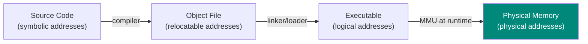
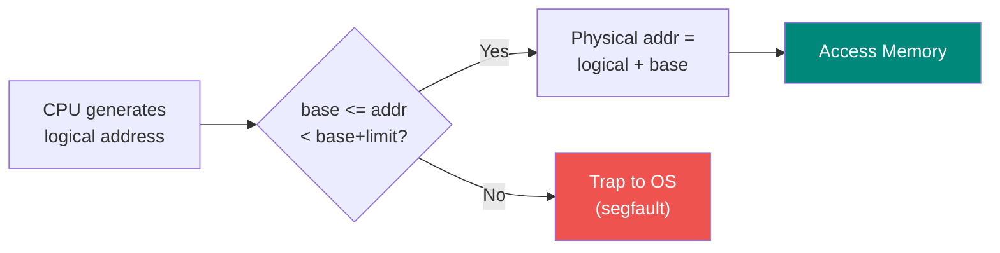
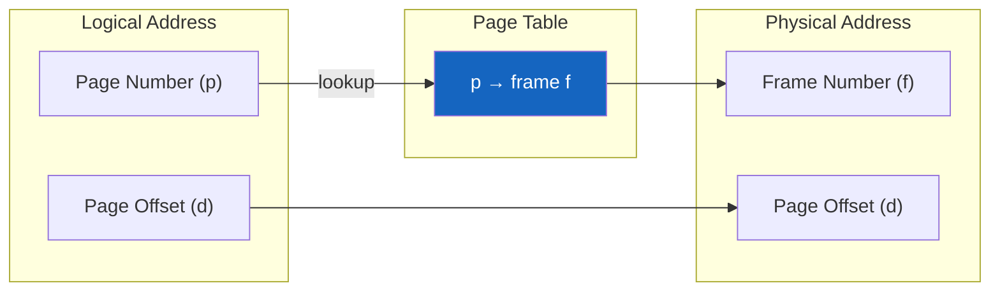
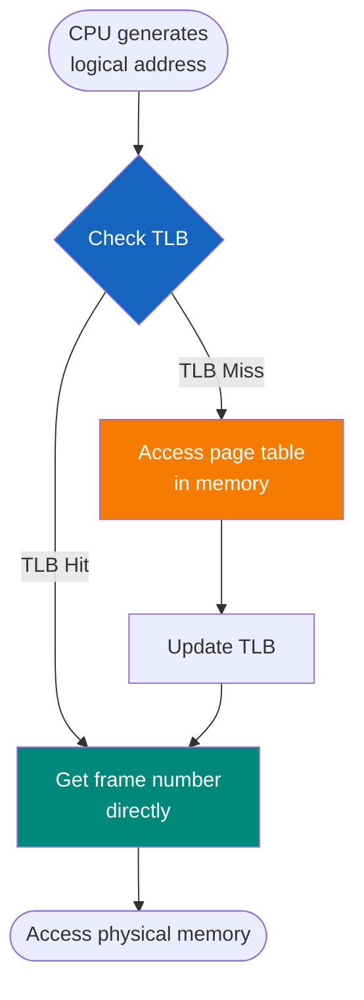
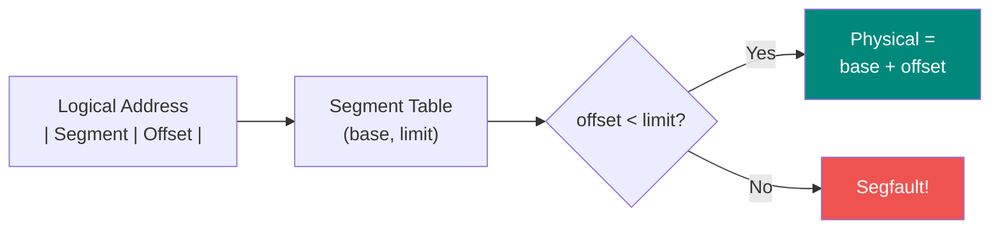

# Memory Management

## Address Binding



The process of mapping logical addresses to physical addresses can happen at:

1. **Compile time**: Absolute code, addresses fixed at compile time
2. **Load time**: Relocatable code, addresses fixed when loaded
3. **Execution time**: Addresses can change during execution (requires MMU hardware)

---

## Base and Limit Registers



- **Base register**: Smallest legal physical address
- **Limit register**: Size of the address space
- **Translation**: `Physical address = Logical address + Base`

---

## Paging

Divides physical memory into fixed-size **frames** and logical memory into **pages** of the same size.



### Benefits

- Eliminates external fragmentation
- Allows non-contiguous allocation
- Simplifies memory management

### Page Table Entry (PTE) contains:

- Frame number
- Valid/invalid bit
- Protection bits (read/write/execute)
- Reference bit
- Modify/dirty bit

### Formulas

```
Page size              = 2^(offset_bits)
Number of pages        = Logical address space / Page size
Page table size        = Number of pages × Entry size
Physical address       = (frame number × page size) + page offset
```

### Example

```
Logical address space: 2^16 = 64K
Page size: 2^10 = 1K
Page offset bits: 10
Page number bits: 16 - 10 = 6
Number of pages: 64

Logical address 2500:
  Page number: 2500 / 1024 = 2
  Page offset: 2500 mod 1024 = 452

If page table[2] = frame 6:
  Physical address = (1024 × 6) + 452 = 6596
```

---

## Translation Lookaside Buffer (TLB)

A small, fast cache for page table entries.



**Effective Access Time:**
```
EAT = (hit_rate × TLB_time) + ((1 - hit_rate) × (TLB_time + mem_time))

Example:
  TLB hit rate = 80%, TLB = 20ns, Memory = 100ns
  EAT = 0.8×20 + 0.2×(20+100) = 16 + 24 = 40ns
```

---

## Multi-level Paging

For large address spaces, page tables become too large. Use hierarchical page tables.


---

## Segmentation

Divides memory into variable-size segments based on logical units (code, data, stack).



**Segment table** contains:
- **Base**: Starting physical address of segment
- **Limit**: Length of segment

---

## Segmentation with Paging

Combines benefits of both:
- Segments provide logical organization
- Pages eliminate external fragmentation

Each segment has its own page table.