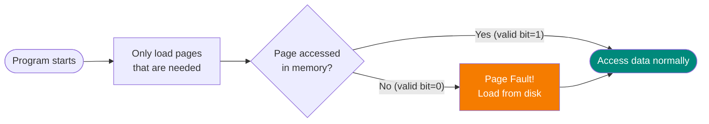
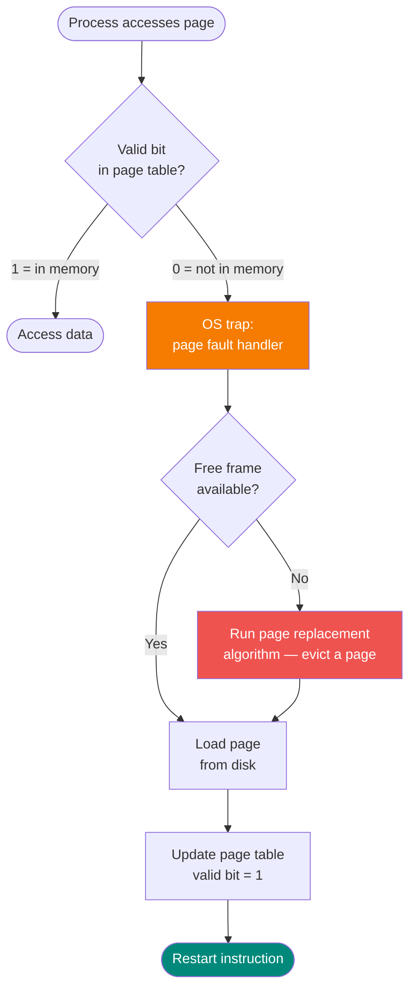
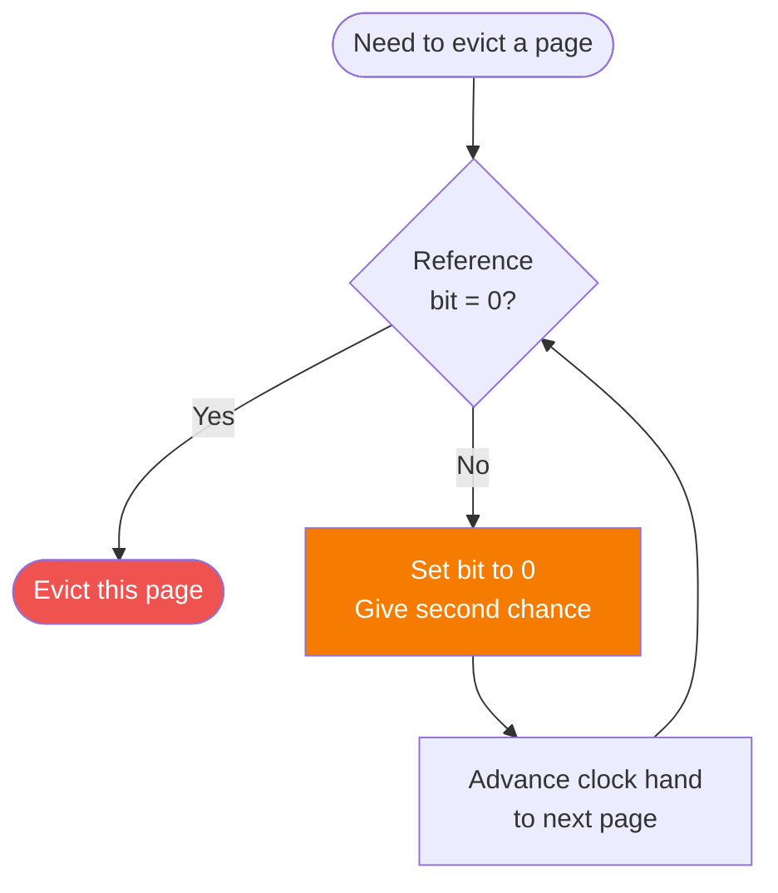
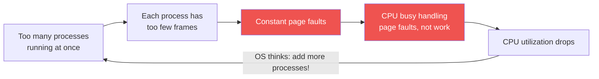

# Virtual Memory

## Demand Paging

Pages are loaded into memory only when they are demanded during execution.



**Benefits:**
- Less I/O needed
- Less memory needed
- Faster startup
- More processes can run

---

## Page Fault



---

## Page Replacement Algorithms

### FIFO (First-In, First-Out)

Replace the **oldest** page in memory.


!!! warning "Belady's Anomaly"
    More frames can sometimes cause MORE page faults with FIFO!

---

### Optimal (OPT)

Replace the page that will **not be used for the longest time** in the future.

- **Advantage**: Theoretical minimum page faults
- **Disadvantage**: Requires future knowledge — impossible to implement
- **Purpose**: Benchmark to compare other algorithms

---

### LRU (Least Recently Used)

Replace the page **not used for the longest time in the past**.


- **Advantage**: Good approximation of OPT
- **Disadvantage**: Expensive to implement (needs hardware support)

---

### Second Chance (Clock Algorithm)

Approximation of LRU using a **reference bit**.



---

## Page Replacement Comparison

| Algorithm | Faults | Implementable | Notes |
|-----------|--------|---------------|-------|
| OPT | Minimum | No | Theoretical benchmark |
| LRU | Near OPT | Expensive | Best practical choice |
| Second Chance | Good | Yes | LRU approximation |
| FIFO | Worst | Yes | Belady's anomaly |

---

## Frame Allocation

### Equal Allocation
Each process gets `m/n` frames (m = total frames, n = processes)

**Problem**: Ignores process size differences

### Proportional Allocation

```
frames_i = (s_i / S) × m

where s_i = size of process i, S = total size, m = total frames
```

---

## Thrashing

A process is **thrashing** when it spends more time paging than executing.



**Solution:**
- Decrease degree of multiprogramming (run fewer processes)
- Increase available memory
- Use working set model

---

## Effective Access Time with Paging

```
Memory access time     = 200ns
Page fault service     = 10ms = 10,000,000ns
Page fault rate        = p

EAT = (1-p) × 200 + p × 10,000,000

For max 10% performance degradation:
EAT < 220ns  →  p < 0.000002
(one page fault per 500,000 accesses)
```