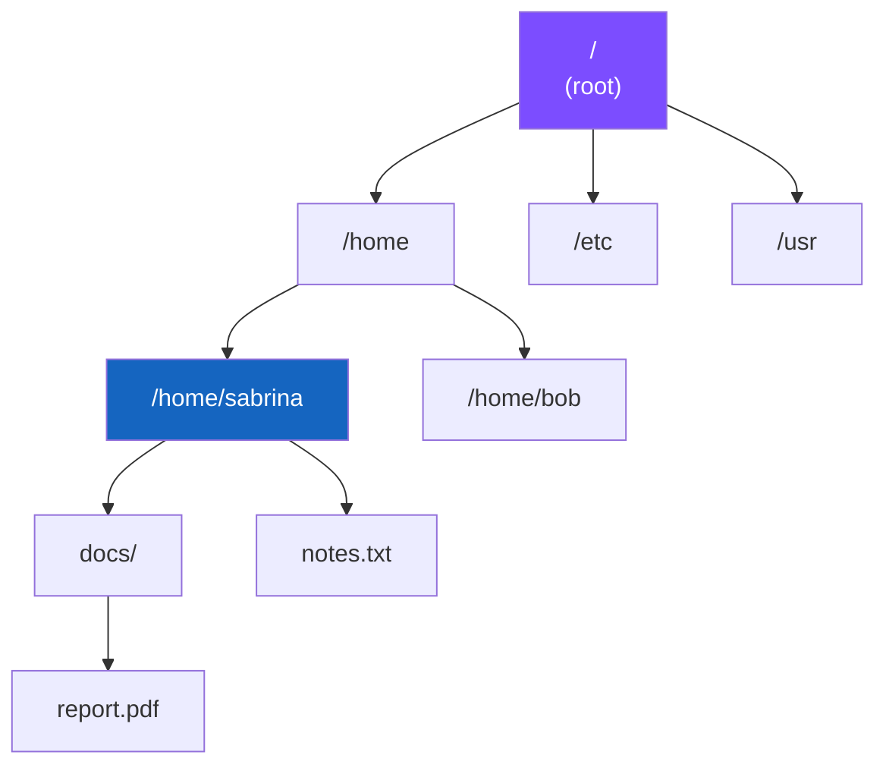
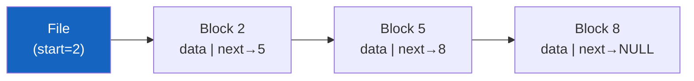
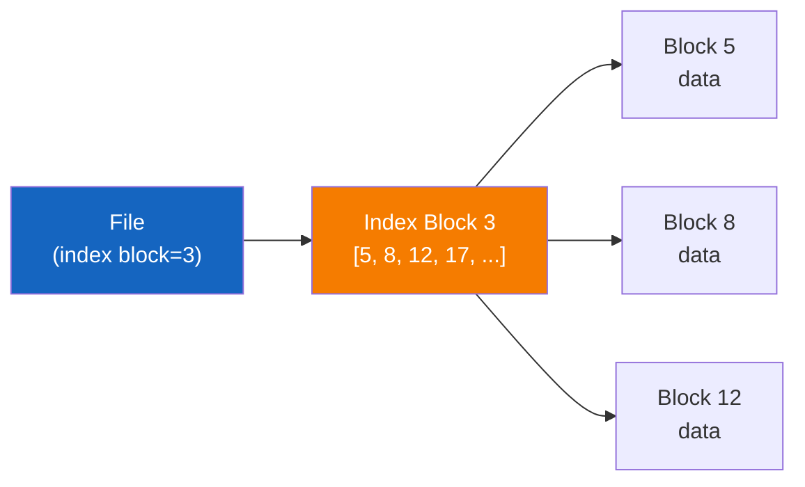
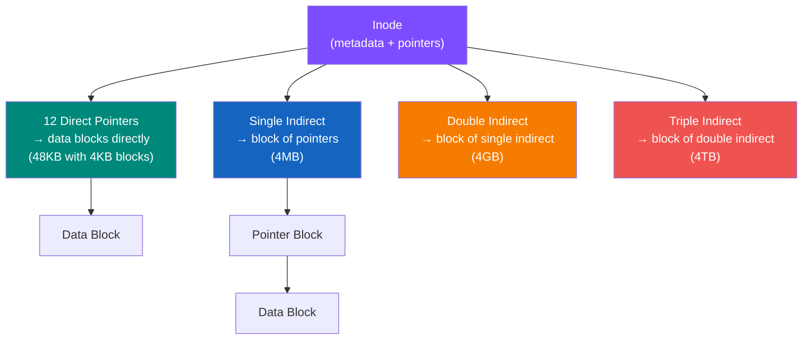

# File Systems

## File Concept

A file is a named collection of related information stored on secondary storage.

**Attributes:** Name, Type, Location, Size, Protection, Timestamps, Owner

**Operations:** Create, Write, Read, Seek, Delete, Truncate

---

## Directory Structure



- **Absolute path**: `/home/sabrina/notes.txt`
- **Relative path**: `../bob/file.txt`

---

## File Allocation Methods

### 1. Contiguous Allocation


- Fast sequential and random access
- External fragmentation
- Hard to grow files

### 2. Linked Allocation



- No external fragmentation
- Slow random access (must traverse list)
- Pointer overhead

### 3. Indexed Allocation



- Fast random access
- No external fragmentation
- Overhead of index block

---

## Inodes (Unix/Linux)



**Example with 4KB blocks:**
```
12 direct:        12 × 4KB       =  48KB
Single indirect:  1K × 4KB       =   4MB
Double indirect:  1K × 1K × 4KB  =   4GB
Triple indirect:  1K³ × 4KB      =   4TB
```

---

## Free Space Management

| Method | How | Pros | Cons |
|--------|-----|------|------|
| Bitmap | 1 bit per block (0=free, 1=used) | Simple, find contiguous blocks | Extra space |
| Linked list | Free blocks linked together | No waste | Slow traversal |
| Grouping | Addresses of n free blocks stored in first free block | Efficient | Complex |
| Counting | First free block + count of contiguous free blocks | Good for contiguous | More complex |

---

## File Permissions (Unix/Linux)

```
rwxr-xr--
|||
||└─ Others:  r-- = 4
|└── Group:   r-x = 5
└─── Owner:   rwx = 7

Octal: 754
```

**For files**: `x` means executable  
**For directories**: `x` means can enter/traverse

---

## Useful Commands

```bash
# List files with inodes
ls -li

# Display file metadata
stat filename

# Disk space usage
df -h              # File system usage
du -sh directory/  # Directory size

# File permissions
chmod 755 file     # rwxr-xr-x
chown user file    # Change owner
```

---

## DMA (Direct Memory Access)

Device controller transfers data directly between device buffer and main memory — without the CPU copying each byte.

